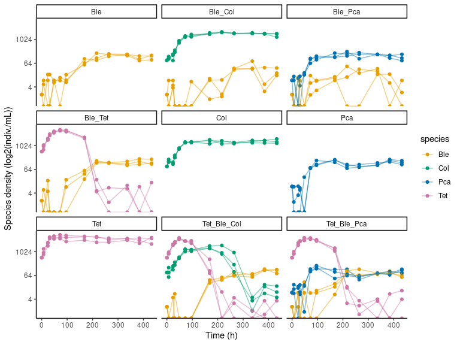
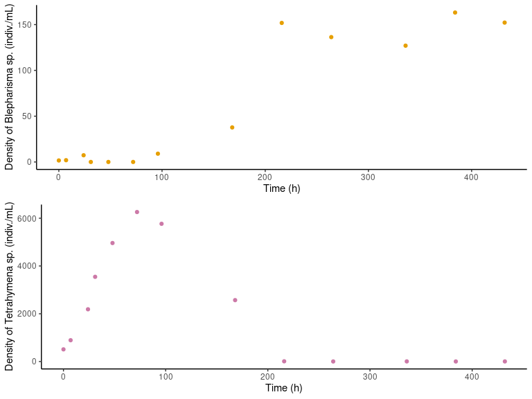
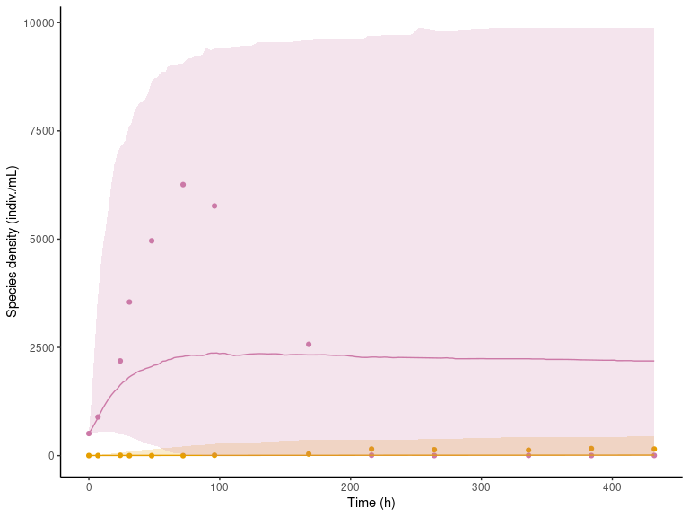
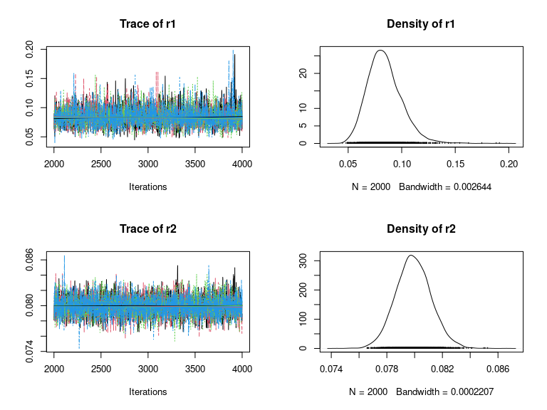
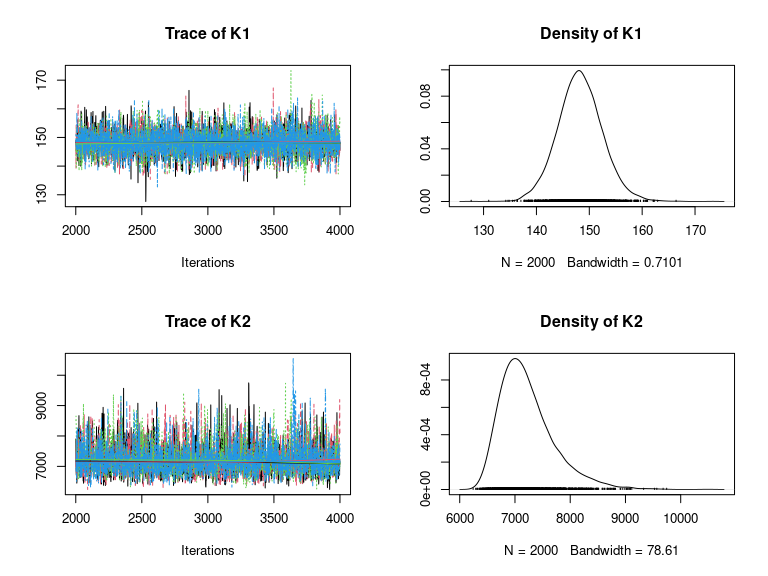
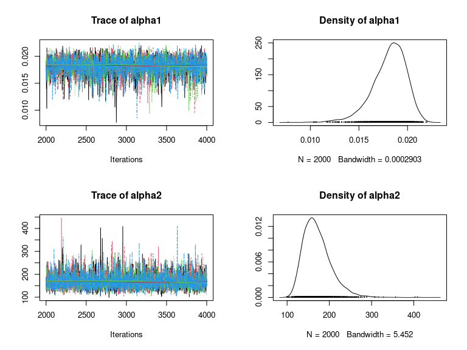
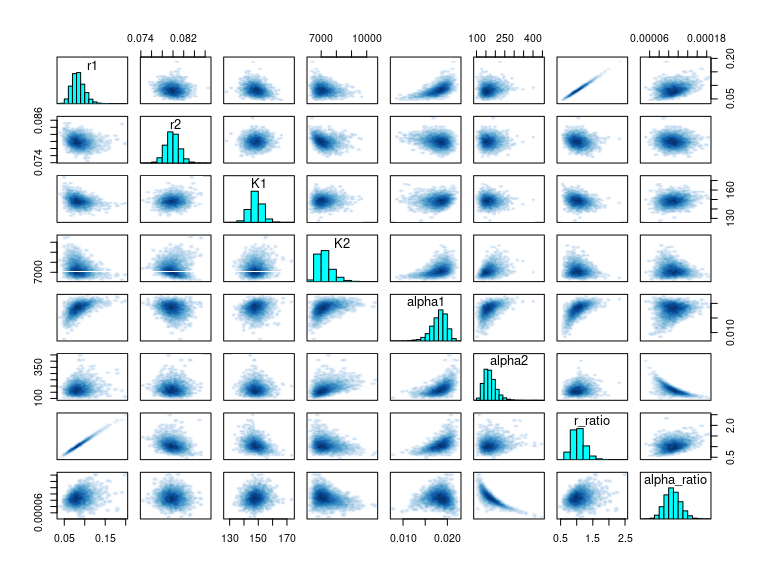
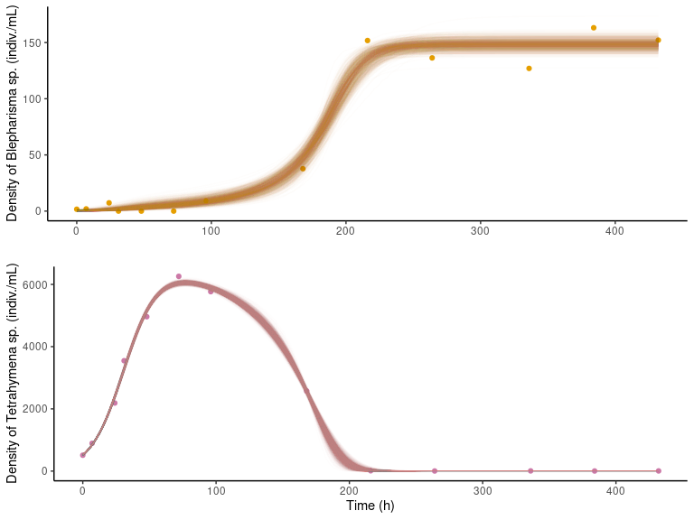
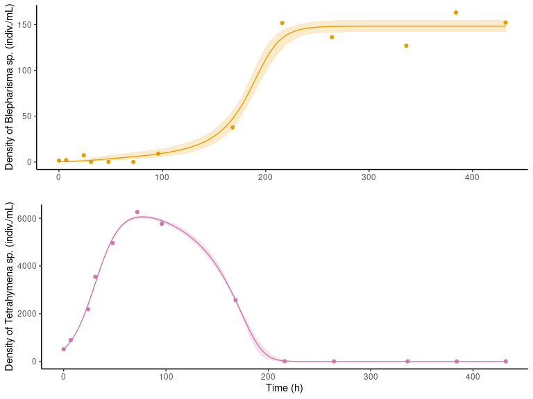
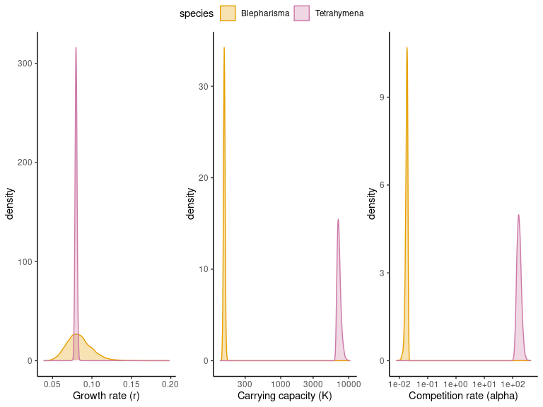

*The code and data for this project is available on [github](https://github.com/c-saade/bayes_demo_fit).*

## Introduction

Demographic models are an invaluable tool in ecology, as they offer insights into the dynamics of species over time.
By estimating ecologically relevant parameters - such as growth rates and competition strength - these models shed light on complex ecological systems and allow to predict their future dynamics or produce _in silico_ experiments.

However, fitting these models can be quite complex and using them for prediction requires robust parameter estimation.
In particular, traditional frequentist approaches often lack the flexibility to accommodate complex models and they offer point estimates which risk missing identifiability issues.
Bayesian approaches on the other hand, are well suited to estimate parameter distributions and allow to identify pathological correlations between parameters at a glance.

In this article, we will use RStan - a bayesian statistical R package - to fit a demographic model onto the time series of two interacting species and find out the mechanisms underlying their dynamics.

## Data

In one of my [research projects](https://doi.org/10.1098/rspb.2022.0543) I studied ecosystems recovery dynamics using microcosms - _i.e._, small laboratory ecosystems inhabited by microorganisms.
To overcome laboratory limitations of experiment duration and ecosystem size, I also reproduced and expanded the experiment _in silico_.
To get a robust parameterization of the simulations, I fitted a demographic model to preliminary data.
We will work with this preliminary data, consisting of growth curves of several unicellular species in isolation and in co-culture.
All species feed on the same resource and are thus in competition when grown together.
Let's first load and inspect the data:


```r
density_data = read.csv("./Data/density_data.csv", header = T, sep = ',')
head(density_data, 10)
```

```
##           file       date time community replicate measure_point      Tet
## 1  sample_0001 2019-01-14   10       Tet         1            t0 509.7026
## 2  sample_0002 2019-01-14   10       Tet         2            t0 509.7026
## 3  sample_0003 2019-01-14   10       Tet         3            t0 509.7026
## 4  sample_0004 2019-01-14   10       Pca         1            t0   0.0000
## 5  sample_0005 2019-01-14   10       Pca         2            t0   0.0000
## 6  sample_0006 2019-01-14   10       Pca         3            t0   0.0000
## 7  sample_0007 2019-01-14   10       Col         1            t0   0.0000
## 8  sample_0008 2019-01-14   10       Col         2            t0   0.0000
## 9  sample_0009 2019-01-14   10       Col         3            t0   0.0000
## 10 sample_0010 2019-01-14   10       Ble         1            t0   0.0000
##         Pca      Col      Ble hours
## 1  0.000000  0.00000 0.000000     0
## 2  0.000000  0.00000 0.000000     0
## 3  0.000000  0.00000 0.000000     0
## 4  8.585816  0.00000 0.000000     0
## 5  8.585816  0.00000 0.000000     0
## 6  8.585816  0.00000 0.000000     0
## 7  0.000000 90.01885 0.000000     0
## 8  0.000000 90.01885 0.000000     0
## 9  0.000000 90.01885 0.000000     0
## 10 0.000000  0.00000 1.640082     0
```

Each line contains the density (individuals/mL) of each species in one of the tubes (identified by the column 'file') at a given point in time (given either by the columns 'date' and 'time' or by the column 'hours').
Each species association ('community') was replicated three times, and replicates are differentiated using the 'replicate' column.
The columns 'Tet', 'Pca', 'Ble' and 'Col' describe the density of four unicellular species, respectively _Tetrahymena thermophila_, _Paramecium caudatum_, _Colpidium_ sp. and _Blepharisma_ sp.

Here is a summary of the columns content:

  - "file": the name of the video sample used for species count and identification, serves as a unique id for each tube.
  - "date": date at which the sample was taken (yyyy-mm-dd).
  - "time": the time of day at which the sample was taken (hour).
  - "community": the species grown in a tube.
  - "replicate": the replicate number.
  - "measure_point": the number of the measurement (t0 to t11)
  - "Tet": the density (individuals/mL) of _Tetrahymena thermophila_
  - "Pca": the density (individuals/mL) of _Paramecium caudatum_ (a species initially considered in the pilot, not used in the final study)
  - "Col": the density (individuals/mL) of _Colpidium_ sp.
  - "Ble": the density (individuals/mL) of _Blepharisma_ sp.
  - "hours": the time passed since the beginning of the culture (in hours).

Let us take a look at the dynamics:

```r
# loading tidyverse and setting a nice theme
library(tidyverse)
theme_set(theme_classic())

# setting a colorblind-friendly palette
library(ggthemes)
# personalized fill palette
scale_fill_colorblind7 = function(.ColorList = 2*1L:4L, ...){
    scale_fill_discrete(..., type = colorblind_pal()(8)[.ColorList])
}
# personalized color
scale_color_colorblind7 = function(.ColorList = 2*1L:4L, ...){
  scale_color_discrete(..., type = colorblind_pal()(8)[.ColorList])
}

options(ggplot2.discrete.colour = scale_color_colorblind7)
options(ggplot2.discrete.fill = scale_fill_colorblind7)
```

```r
# plotting the whole data
density_data %>%
  mutate(Ble = replace(Ble, !grepl('Ble', community), NA)) %>%
  mutate(Col = replace(Col, !grepl('Col', community), NA)) %>%
  mutate(Tet = replace(Tet, !grepl('Tet', community), NA)) %>%
  mutate(Pca = replace(Pca, !grepl('Pca', community), NA)) %>%
  pivot_longer(cols = c("Ble", "Col", "Tet", "Pca"),
               names_to = "species",
               values_to = "density") %>%
  ggplot() +
  geom_point(mapping = aes(x = hours, y = density, color = species)) +
  geom_line(mapping = aes(x = hours, y = density, color = species, group = interaction(species, replicate)), alpha = 0.5) +
  scale_y_continuous(trans='log2') +
  facet_wrap(community ~ .) +
  ylab('Species density (log2(indiv./mL))') +
  xlab('Time (h)')
```



We show here the density of species (on a log scale) over time for each species combination.
Fitting a single model onto all this data is possible, but computationnaly intensive and conceptually difficult.
For the sake of simplicity, we will work only on a subset of the data: the co-culture of _Blepharisma_ sp. and _Tetrahymena thermophila_, and we will average the data across replicates.
If you wish to explore how to take advantage of monocultures, tri-cultures and replications, you can have a look into the papers [data and code](https://doi.org/10.5281/zenodo.6364903).
Let's filter the data and average across replicates:


```r
# filtering data
filtered_data <- 
  density_data %>%
  filter(community == 'Ble_Tet') %>% # keeping only the bi-specific time series (Blepharisma sp. + Tetrahymena sp.)
  select(c(measure_point, hours, Ble, Tet)) %>% # keeping only time variables and species densities
  group_by(measure_point) %>% # averaging each measurement over replicates
  summarise(t = mean(hours), n1 = mean(Ble), n2 = mean(Tet)) %>%
  arrange(t) # sorting by time
```


```r
# plotting the resulting data
library(ggpubr)

panel_a = ggplot(data = filtered_data) +
  geom_point(mapping = aes(x = t, y = n1), color = '#E69F00') +
  xlab('Time (h)') +
  ylab('Density of Blepharisma sp. (indiv./mL)')

panel_b = ggplot(data = filtered_data) +
  geom_point(mapping = aes(x = t, y = n2), color = '#CC79A7') +
  xlab('Time (h)') +
  ylab('Density of Tetrahymena sp. (indiv./mL)')

ggarrange(panel_a, panel_b, nrow = 2)
```



We end up with a single time series for _Blepharisma_ sp. (yellow) and for _Tetrahymena thermophila_ (pink), which is much more manageable in the context of this guide.
For now we can only describe the dynamics verbally: the population of _Tetrahymena thermophila_ grows very fast, reaching a fairly high density of 6000 individuals per mL under 100 hours, before crashing down as the population of _Blepharisma_ sp. grows.
On the contrary, the population of _Blepharisma_ sp. grows fairly slowly, seemingly reaching an equilibrium density of 150 individuals per mL in over 200 hours.
Fitting a demographic model onto this data would allow us to numerically quantify these observations as well as unobservable quantities such as competition rates.

Before delving into the model specifics, the last thing we want to do is transform this data into a list that is manageable by Rstan:


```r
# turning data into a list to give to the Rstan sampler.
data = list(n  = nrow(filtered_data), # number of observations
            t = filtered_data$t, # vector of times
            n1 = filtered_data$n1, # vector of density of species 1 (Ble)
            n2 = filtered_data$n2) # vector of density of species 2 (Tet)
```

## Demographic model

Species dynamics in ecology are often described using differential equations which give the instantaneous growth rate of a population as a function of its current density.
The go-to model to describe the dynamics of two species in competition is the [competitive Lotka-Volterra model](https://en.wikipedia.org/wiki/Competitive_Lotka%E2%80%93Volterra_equations):

$$
\begin{aligned}
\dfrac{dn_1}{dt} = r_1 n_1 \left(1 - \dfrac{n_1 + \alpha_1 n_2}{K_1} \right)\\
\dfrac{dn_2}{dt} = r_2 n_2 \left(1 - \dfrac{n_2 + \alpha_2 n_1}{K_2} \right)
\end{aligned}
$$
With the following variables:

  - $t$, the time.
  - $n_1$ and $n_2$, the densities of species 1 and 2.
  
And the following parameters

  - $r_1$ and $r_2$, the growth rates of species 1 and 2.
  - $K_1$ and $K_2$, the carrying capacities of species 1 and 2 (_i.e._, their equilibrium density when grown in isolation).
  - $\alpha_1$ and $\alpha_2$, the competition rates: $\alpha_1$ measures the effect that an individual of species 2 has on the growth of species 1 and conversely.
$\alpha_1 \sim 0$ would mean that species 2 has no effect on species 1 (_e.g._, if species 1 is way more efficient than species 2, or if the two species do not compete for the same resource).
$\alpha_1 \sim 1$ would mean that the two species are competitively equivalent.
$\alpha_1 > 1$ would mean that species 2 has a strong negative effect on the growth of species 1.

We thus need to infer the 6 model parameters ($r_1$, $r_2$, $K_1$, $K_2$, $\alpha_1$, $\alpha_2$) as well as the initial conditions for species densities since the measured initial conditions suffer from measurement errors and cannot be used as true values. We will write these initial conditions $n_{10sim}$ and $n_{20sim}$.

## Stan implementation

We can specify the model in [stan's programming language](https://mc-stan.org/docs/reference-manual/index.html), a pseudo C language.
We write the model as a string (or a text file) organized in several blocks:

  - ```functions```: to declare any utility functions necessary to the fit.
  - ```data```: to declare the structure (type, size...) of the data fed to the model.
  - ```parameters```: to declare the model parameters.
  - ```model```: to declare parameter priors and how to compute the likelyhood.
  - ```generated quantities```: to declare any quantity we want the sampler to compute along the way.
  
Let's declare and compile the model in the next code chunk before explaining each bloc in detail:
  

```r
# loading rstan
library(rstan)

# declaring the model as a string
model_str = '
functions{
  real[] odemodel(real t, real[] N, real[] p, real[] x_r, int[] x_i){
    // p[1]=r1, p[2] = r2, p[3] = K1, p[4] = K2, p[5] = alpha1, p[6] = alpha2 
    real dNdt[2]; 
    dNdt[1] = p[1]*N[1]*(1 - (N[1] + p[5]*N[2])/p[3]);
    dNdt[2] = p[2]*N[2]*(1 - (p[6]*N[1] + N[2])/p[4]);
    return dNdt;
  }
}

data{
  int n; // number of observations
  real t[n]; // time
  real n1[n]; // observations n1
  real n2[n]; // observations n2
}

parameters{
  real<lower=0> r1; // growth rate
  real<lower=0> r2; // growth rate
  real<lower=0> K1; // carrying capacity
  real<lower=0> K2; // carrying capacity
  real<lower=0> alpha1; // comp term
  real<lower=0> alpha2; // comp term
  real<lower=0> n10sim; // initial density n1
  real<lower=0> n20sim; // initial density n2
  real<lower=0> sdev1;
  real<lower=0> sdev2;
}

model{
  real p[6]; // vector of parameters for the ODE
  real simval[n-1,2]; // simulated values, matrix. dim1 = time without t0, dim2 = dim_ODE = 2
  
  // priors 
  r1 ~ lognormal(-3,1);
  r2 ~ lognormal(-2,1);
  K1 ~ lognormal(5, 0.8);
  K2 ~ lognormal(8, 0.8);
  alpha1 ~ lognormal(-3,1);
  alpha2 ~ lognormal(2.5,1);
  n10sim ~ normal(n1[1],5);
  n20sim ~ normal(n2[1],10);
  sdev1 ~ gamma(1, 1);
  sdev2 ~ gamma(1, 1);
  
  // parameters for integrator
  p[1] = r1;
  p[2] = r2;
  p[3] = K1;
  p[4] = K2;
  p[5] = alpha1;
  p[6] = alpha2;

  // integrate ODE
  simval = integrate_ode_rk45(odemodel, {n10sim, n20sim}, t[1], t[2:n], p, rep_array(0.0,0), rep_array(0,0));
  // likelihood
  n1[1] ~ normal(n10sim, sdev1);
  n2[1] ~ normal(n20sim, sdev2);
  for (i in 2:n){
    n1[i] ~ normal(simval[i-1, 1], sdev1);
    n2[i] ~ normal(simval[i-1, 2], sdev2);
  }
}

generated quantities{
  real r_ratio = r1/r2;
  real alpha_ratio = alpha1/alpha2;
}
'

# compiling the model
model = stan_model(model_code=model_str)
```

### functions{}

The only function we need here is the ODE of the Lotka-Volterra model.
At each step, the sampler will use it to simulate the dynamics of a given set of parameters which will serve to compute the likelihood.

```{}
functions{
  real[] odemodel(real t, real[] N, real[] p, real[] x_r, int[] x_i){
    // p[1]=r1, p[2] = r2, p[3] = K1, p[4] = K2, p[5] = alpha1, p[6] = alpha2 
    real dNdt[2]; 
    dNdt[1] = p[1]*N[1]*(1 - (N[1] + p[5]*N[2])/p[3]);
    dNdt[2] = p[2]*N[2]*(1 - (p[6]*N[1] + N[2])/p[4]);
    return dNdt;
  }
}
```


### data{}

Here we declare the data that we will give to the sampler:

  - ```n``` is an integer describing the number of observations, which we need to declare the length of the data vectors.
  - ```t``` it the vector of times, in hours.
  - ```n1``` and ```n2``` are the vectors of species densities.
  
```{}
data{
  int n; // number of observations
  real t[n]; // time
  real n1[n]; // observations n1
  real n2[n]; // observations n2
}
```


### parameters{}

Here we declare the model parameters, _i.e._, the quantities that the sampler need to estimate:
  
  - the ```r```'s, ```K```'s and ```alpha```'s are the parameters for the Lotka-Volterra model
  - ```n10sim``` and ```n_20sim``` are the initial densities of both species. As stated above, they need to be estimated as parameters to avoid propagating the error from erroneous measures of the initial conditions.
  - ```sdev1``` and ```sdev2``` are parameters for the residual distribution of species 1 and 2.
  

```{}
parameters{
  real<lower=0> r1; // growth rate
  real<lower=0> r2; // growth rate
  real<lower=0> K1; // carrying capacity
  real<lower=0> K2; // carrying capacity
  real<lower=0> alpha1; // comp term
  real<lower=0> alpha2; // comp term
  real<lower=0> n10sim; // initial density n1
  real<lower=0> n20sim; // initial density n2
  real<lower=0> sdev1;
  real<lower=0> sdev2;
}
```


### model{}

Finally, we can write the bulk of the model.
This block is used to declare how to compute the likelyhood from a given set of parameters.
To do so, we need to declare the parameters prior distributions, to write down how to simulate dynamics and finally how to compute likelyhood from simulated dynamics and data.

We first declare the variables that will be used in this block.
We need to declare a vector ```p``` to feed the parameters of the Lotka-Volterra model to rstan's integrator, and a vector
```simval``` in which we will store the outpout of the numerical integration. It is of length ```n-1``` because the initial conditions are estimated as a parameter, and of width 2 to store the densities of both species.
```{}
model{
  real p[6]; // vector of parameters for the ODE
  real simval[n-1,2]; // simulated values, matrix. dim1 = time without t0, dim2 = dim_ODE = 2
```


Next, we need to declare a prior distribution of all parameters.
Prior distributions will constrain the parameter space explored by the sampler.
Uninformative priors can lead to very slow sampling and convergence issues, while very informative priors keep the model from exploring less common but plausible parameters.
We thus want to set priors that make sense with our data _i.e._, that lie within a reasonable range.
We can do so by visually estimating order of magnitude for most parameters:

  - Growth rates (```r1``` and ```r2```) order of magnitude can be roughly estimated from the population doubling time at low density ($r \sim \dfrac{1}{doubling\ time}$).
  - Carrying capacities (```K1``` and ```K2```) order of magnitude can be roughly estimated using the maximum density.
  - Competition rates (```aplpha1``` and ```alpha2```) order of magnitude are a bit tougher to estimate. However, we can safely estimate that $$\alpha_1 << 1$$ since _Blepharisma_ sp. is able to grow despite the large density of _Tetrahymena thermophila_ and that $$\alpha_2 >> 1$$ since the population of _Tetrahymena thermophila_ declines when _Blepharisma_ sp. starts to grow.
  - The initial densities (```n10sim``` and ```n20sim```) can be estimated to be on the same order of magnitude as the measured initial densities.
  
Once we have rough estimates, we chose priors centered on these estimates and with a variance reflecting the confidence we have on our estimate:

```{}
  // priors 
  r1 ~ lognormal(-3,1);
  r2 ~ lognormal(-2,1);
  K1 ~ lognormal(5, 0.8);
  K2 ~ lognormal(8, 0.8);
  alpha1 ~ lognormal(-3,1);
  alpha2 ~ lognormal(2.5,1);
  n10sim ~ normal(n1[1],5);
  n20sim ~ normal(n2[1],10);
  sdev1 ~ gamma(1, 1);
  sdev2 ~ gamma(1, 1);
```

The shape of priors is somewhat up to you but normal, lognormal and gamma distributions are good to keep in mind.
The normal distribution is often a go-to for parameters we think are symmetrically distributed around a mean (_e.g._, initial densities).
The lognormal distribution is a distribution whose logarithm is normally distributed.
It is useful to enforce positive parameters without setting a hard boundary.
The gamma distribution is very useful for its flexibility, as its first parameter can change its shape drastically.
Here for exemple, we get an exponential distribution for the variance of the residuals by setting this parameter to 1.

#### note: prior predictions
It is always a good idea to check the validity of our priors by making prior predictions, _i.e._, taking a look at model predictions when sampling parameters from the priors and checking that data falls into the predicted range:


```r
# declaring a function that draws parameters from the prior distributions
draw_random_parameters = function(){
  params = list()
  params['r1'] = rlnorm(1, -3, 1)
  params['r2'] = rlnorm(1, -2, 1)
  params['K1'] = rlnorm(1, 5, 0.8)
  params['K2'] = rlnorm(1, 8, 0.8)
  params['alpha1'] = rlnorm(1, -3, 1)
  params['alpha2'] = rlnorm(1, 2.5, 1)
  params['n10sim'] = abs(rnorm(1, 1.64,5))
  params['n20sim'] = rnorm(1, 510,10)
  return(params)
}

# declaring the ode to the Lotka-Volterra model
ode.model = function(t,N,p){
  r1 = p$r1
  r2 = p$r2
  K1 = p$K1
  K2 = p$K2
  alpha1 = p$alpha1
  alpha2 = p$alpha2
  dn1 = r1*N[1]*(1-(N[1]+alpha1*N[2])/K1)
  dn2 = r2*N[2]*(1-(alpha2*N[1]+N[2])/K2)
  return(list(c(dn1, dn2)))
}

# Sampling 1000 parameter combinations from the prior distributions and simulating dynamics
library(deSolve)
n_prior_pred = 1000
times = seq(min(filtered_data$t), max(filtered_data$t), length.out = 200)
for (k in 1:n_prior_pred){
  par = draw_random_parameters()
  sim = ode(unlist(c(par['n10sim'], par['n20sim'])),
            times, ode.model, par,
            method = 'ode45')
  
  temp  = data.frame(time = sim[,1], n1 = sim[,2], n2 = sim[,3], id = k)
  
  if (k == 1) {
    predictions = temp
  } else {
    predictions = rbind(predictions, temp)
  }
}

# plotting median and 5% quantiles of prior predictions over the data
ggplot(filtered_data) +
  geom_point(mapping = aes(x = t, y = n1), color = '#E69F00') +
  geom_point(mapping = aes(x = t, y = n2), color = '#CC79A7') +
  stat_summary(data = predictions, mapping = aes(x = time, y = n1),
               fun.min = function(x) quantile(x, 0.05),
               fun.max = function(x) quantile(x, 0.95),
               geom = 'ribbon', fill = '#E69F00', alpha = 0.2) +
  stat_summary(data = predictions, mapping = aes(x = time, y = n1),
               fun = median,
               geom = 'line', color = '#E69F00') +
  stat_summary(data = predictions, mapping = aes(x = time, y = n2),
               fun.min = function(x) quantile(x, 0.05),
               fun.max = function(x) quantile(x, 0.95),
               geom = 'ribbon', fill = '#CC79A7', alpha = 0.2) +
  stat_summary(data = predictions, mapping = aes(x = time, y = n2),
               fun = median,
               geom = 'line', color = '#CC79A7') +
  xlab('Time (h)') +
  ylab('Species density (indiv./mL)')
```



The observed data (points) falls well within the range of the prior predictions (shaded areas), so we can be confident in our prior choices.

We fill in the vector ```p```:
```{}
  // parameters for integrator
  p[1] = r1;
  p[2] = r2;
  p[3] = K1;
  p[4] = K2;
  p[5] = alpha1;
  p[6] = alpha2;
```

We then simulate dynamics using the function ```odemodel``` that we declared in the ```functions``` block and store them in ```simval```:
```{}
  // integrate ODE
  simval = integrate_ode_rk45(odemodel, {n10sim, n20sim}, t[1], t[2:n], p, rep_array(0.0,0), rep_array(0,0));
```

Finally, we compute the likelihood by comparing simulated values and data.
We chose to consider that the observed data points are normally distributed around the simulated values.
This way, large discrepancies between the data and simulated values will result in a low likelihood.

```{}
  // likelihood
  n1[1] ~ normal(n10sim, sdev1);
  n2[1] ~ normal(n20sim, sdev2);
  for (i in 2:n){
    n1[i] ~ normal(simval[i-1, 1], sdev1);
    n2[i] ~ normal(simval[i-1, 2], sdev2);
  }
}
```

### generated quantities{}

Finally, we can ask the sampler for generated quantities.
For exemple, we might be interested in ratio of parameters between species to see at a glance how fast a species grows or how well is competes against the other species.
We do so by declaring two new variables, ```r_ratio``` and ```alpha_ratio```:

```{}
generated quantities{
  real r_ratio = r1/r2;
  real alpha_ratio = alpha1/alpha2;
}
```

### Model fit

Once the model is declared and compiled, we can get into the fit itself.
We first declare some hyperparameters (parameters of the sampler) and then run the fit:


```r
# stan options
  # number of parallel chains
  chains = 4
  options(mc.cores = chains)
  
  # number of total iterations and warm-up steps
  iter   =  4000
  warmup =  2000
  
  # initial parameters choice
  init=rep(list(list(r1=0.01,
                   r2=0.1,
                   K1 = 150,
                   K2 = 4000,
                   alpha1 = 1,
                   alpha2 = 1,
                   n10sim=5,
                   n20sim=500,
                   sdev1 = 1,
                   sdev2 = 1)), chains)
# model fit
fit = sampling(model,
                  data=data,
                  iter=iter,
                  warmup=warmup,
                  chains=chains,
                  init=init,
                  control = list(adapt_delta = 0.98, max_treedepth=15),
                  seed = 123)

save(fit, file="./out/fit_posterior.RData")
```


## Model diagnostic

Once the model is fitted, we need to diagnose the output to ensure that there is no pathological behavior.
In particular, we want to ensure that the different chains are well mixed (_i.e._, that the four independent fit end up in the same place) and that parameters are well identifiable.

### Checking R-hat and n_eff
The first thing we can do is check some summary statistics.


```r
print(fit)
```

```
## Inference for Stan model: 3d1470e5f2399a4023378a28c70989ca.
## 4 chains, each with iter=4000; warmup=2000; thin=1; 
## post-warmup draws per chain=2000, total post-warmup draws=8000.
## 
##                mean se_mean     sd    2.5%     25%     50%     75%   97.5%
## r1             0.08    0.00   0.02    0.06    0.07    0.08    0.09    0.12
## r2             0.08    0.00   0.00    0.08    0.08    0.08    0.08    0.08
## K1           148.27    0.06   4.21  140.13  145.53  148.18  150.95  156.86
## K2          7222.06    9.60 495.30 6516.70 6870.53 7134.41 7470.20 8450.70
## alpha1         0.02    0.00   0.00    0.01    0.02    0.02    0.02    0.02
## alpha2       171.49    0.53  33.23  121.91  147.74  166.60  189.33  248.38
## n10sim         0.31    0.00   0.25    0.04    0.14    0.24    0.39    0.98
## n20sim       510.72    0.12   9.42  492.49  504.43  510.75  517.07  529.06
## sdev1          8.65    0.02   1.44    6.25    7.63    8.48    9.51   11.86
## sdev2         57.72    0.05   4.28   49.99   54.77   57.50   60.45   66.80
## r_ratio        1.05    0.00   0.20    0.71    0.91    1.03    1.17    1.50
## alpha_ratio    0.00    0.00   0.00    0.00    0.00    0.00    0.00    0.00
## lp__        -186.46    0.04   2.34 -191.91 -187.79 -186.11 -184.77 -182.89
##             n_eff Rhat
## r1           3099    1
## r2           4417    1
## K1           5609    1
## K2           2664    1
## alpha1       2604    1
## alpha2       3945    1
## n10sim       2529    1
## n20sim       5749    1
## sdev1        5094    1
## sdev2        6617    1
## r_ratio      3095    1
## alpha_ratio  6346    1
## lp__         3053    1
## 
## Samples were drawn using NUTS(diag_e) at Wed Aug  2 23:55:56 2023.
## For each parameter, n_eff is a crude measure of effective sample size,
## and Rhat is the potential scale reduction factor on split chains (at 
## convergence, Rhat=1).
```

Printing the model fit yields summary statistics for all inferred parameters.
Pay close attention to the last two statistics, ```n_eff``` and ```Rhat```.

```n_eff``` is a measure of the effective number of samples.
Here, all parameters have more than a thousand effective samples, which should give us a good description of the posterior shape.

```Rhat``` is a measure of chain mixing, roughly similar to inter-chain variability over intra-chain variability.
The closer ```Rhat``` is to 1, the better mixed the chains are, indicating that the model converged.
We usually consider that fit with some Rhat larger that 1.01 have not reached convergence and should be run longer or reparameterized.
Here, all Rhat are displayed as 1 (rounded at 2 decimal places) so the model has converged.

### Inspecting chains
We can also inspect the posteriors visually by looking at the trace and density plots.
Trace plots show the parameters values over iterations, density plots show the posterior distribution of parameters.
For a healthy sample, trace plots should look stationnary (constant mean over iteration) with indistinguishable chains, and density plots should be unimodal.
Everything here looks good.


```r
library(coda)
params = c("r1","r2", "K1", "K2", "alpha1", "alpha2", "r_ratio", "alpha_ratio")
samples=As.mcmc.list(fit)
traceplot(samples[, params[1:6]])
```


### Pair plots
Lastly, we can check the pair plot of the posteriors.
We want to ensure that there is no near perfect correlation between parameters, which would indicate non identifiability.
By design, r1 and r_ratio are strongly correlated.
This is not an issue because r_ratio is a generated parameter computed from r1.
Aside from this, there are no strong correlation between inferred parameters.


```r
pairs(fit, pars=params)
```




## Posterior predictions
Now that we have diagnosed our model, we can check its predictions.
To do so, we sample 1000 parameter values from the posterior distributions and simulate the resulting dynamics.
We can then plot these dynamics over our data to check if the model is a good fit.


```r
library(deSolve)
```


```r
# declaring the lotka-volterra model
ode.model = function(t,N,p){
  r1 = p$r1
  r2 = p$r2
  K1 = p$K1
  K2 = p$K2
  alpha1 = p$alpha1
  alpha2 = p$alpha2
  dn1 = r1*N[1]*(1-(N[1]+alpha1*N[2])/K1)
  dn2 = r2*N[2]*(1-(alpha2*N[1]+N[2])/K2)
  return(list(c(dn1, dn2)))
}
```


```r
# sampling 1000 values from the posterior distribution and
# computing the predicted dynamics for each
n_post = 1000
times = seq(min(data$t), max(data$t), length.out = 200)
posteriors = as.matrix(fit)
for (k in 1:n_post){
  par = posteriors[sample(1:nrow(posteriors), 1),]
  sim = ode(c(par['n10sim'], par['n20sim']),
            times, ode.model, list(r1 = par['r1'],
                                   r2= par['r2'],
                                   K1 = par['K1'],
                                   K2 = par['K2'],
                                   alpha1 = par['alpha1'],
                                   alpha2 = par['alpha2']),
            method = 'ode45')
  
  temp  = data.frame(time = sim[,1], n1 = sim[,2], n2 = sim[,3], id = k)
  
  if (k == 1) {
    predictions = temp
  } else {
    predictions = rbind(predictions, temp)
  }
}
```


```r
# plotting the 1000 predictions over the data
panel_a = ggplot(filtered_data) +
  geom_point(mapping = aes(x = t, y = n1), color = '#E69F00') +
  geom_line(data = predictions, mapping = aes(x = time, y = n1, group = id), color = '#E69F00', alpha = 0.01) +
  xlab('') +
  ylab('Density of Blepharisma sp. (indiv./mL)')

panel_b = ggplot(filtered_data) +
  geom_point(mapping = aes(x = t, y = n2), color = '#CC79A7') +
  geom_line(data = predictions, mapping = aes(x = time, y = n2, group = id), color = '#CC79A7', alpha = 0.01) +
  xlab('Time (h)') +
  ylab('Density of Tetrahymena sp. (indiv./mL)')

ggarrange(panel_a, panel_b, nrow = 2)
```



Alternatively, we can plot the median and 5\% percentile rather that all the predictions:


```r
# plotting the median and 5\% quantiles
panel_a = ggplot(filtered_data) +
  geom_point(mapping = aes(x = t, y = n1), color = '#E69F00') +
  stat_summary(data = predictions, mapping = aes(x = time, y = n1),
               fun.min = function(x) quantile(x, 0.05),
               fun.max = function(x) quantile(x, 0.95),
               geom = 'ribbon', fill = '#E69F00', alpha = 0.2) +
  stat_summary(data = predictions, mapping = aes(x = time, y = n1),
               fun = median,
               geom = 'line', color = '#E69F00') +
  xlab('') +
  ylab('Density of Blepharisma sp. (indiv./mL)')

panel_b = ggplot(filtered_data) +
  geom_point(mapping = aes(x = t, y = n2), color = '#CC79A7') +
  stat_summary(data = predictions, mapping = aes(x = time, y = n2),
               fun.min = function(x) quantile(x, 0.05),
               fun.max = function(x) quantile(x, 0.95),
               geom = 'ribbon', fill = '#CC79A7', alpha = 0.2) +
  stat_summary(data = predictions, mapping = aes(x = time, y = n2),
               fun = median,
               geom = 'line', color = '#CC79A7') +
  xlab('Time (h)') +
  ylab('Density of Tetrahymena sp. (indiv./mL)')

ggarrange(panel_a, panel_b, nrow = 2)
```



## Conclusion
Using Rstan, we have been able to fit the Lotka-Volterra model to experimental time series.
This allowed us to estimate the growth rate, carrying capacity and interspecific competition strength of two protist species (_Blepharisma_ sp. and _Tetrahymena thermophila_) on the same medium:



We can see that both species grow at similar rates (despite the larger uncertainty on _Blepharisma_ sp.'s growth rate), but their carrying capacities and competition rates are orders of magnitudes apart.
In particular, _Blepharisma_ sp. experiences very low competition but exerts a strong competition on _Tetrahymena thermophila_, which explains why the former ends up excluding the latter.

For the sake of demonstration, we have worked here with a very simple model on a single time series.
However, Rstan's flexibility allows to build finer model taking advantage of experimental replicates and various time series (_e.g._, mono-, bi- and tri-specific time series).
If you want to delve into the specific of such a model, I invite you to check out the [code](https://doi.org/10.5281/zenodo.6364903) for the research article from which the data comes.

